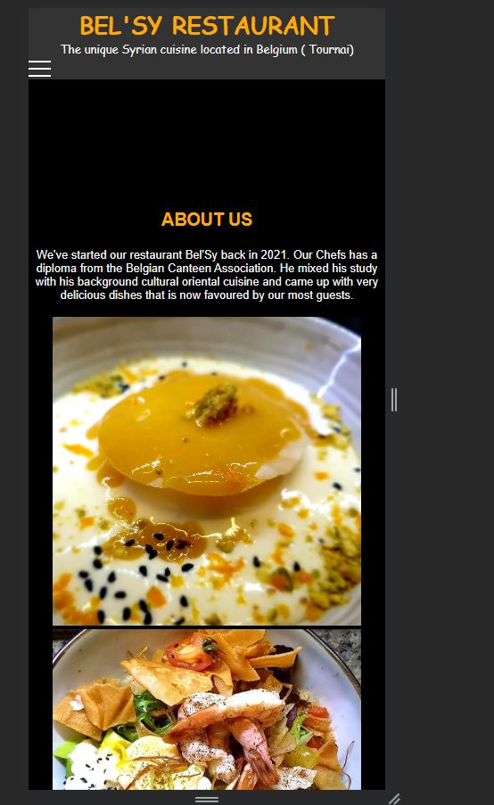
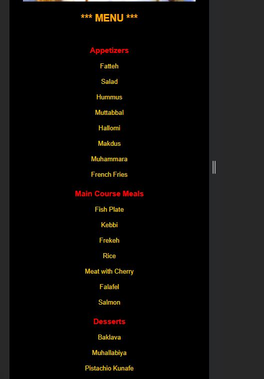
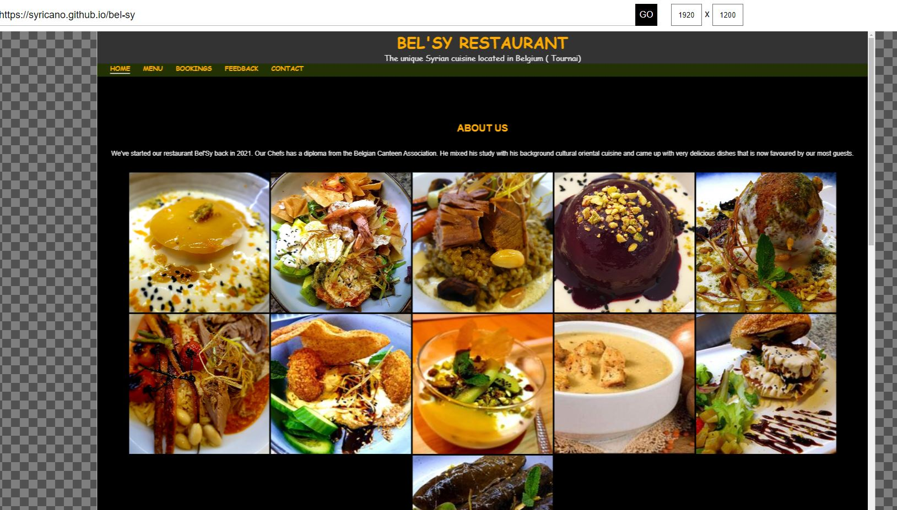
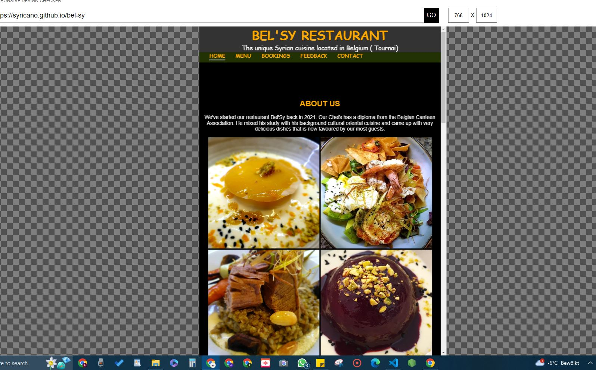

# Bel-Sy_Restaurant

[Bel-Sy Restaurant](https://syricano.github.io/bel-sy/) is a website for Restaurant.
This is the homepage of Bel'Sy restaurant , located in Tournai Belgium. It helps the potential page visitors to become actual guests/customers, by  giving them  an idea of the cuisine ,food, drinks, service  quality and the environment of the place .  
The website will target all users , whom are looking for a place in tournai to dine-in.
The features that will be included in the websites, images of the food, drinks, tables will attract them and give them an imagination idea how the place looks .

## Technologies used:
- HTML
- CSS
---

## User Stories

- As a user:
- I want to be able to see some pictures of the meals, so I know if the food is good for me.
- I want to see their drinks variety.
- I want to see if they have a desserts.
- I want to see if they have their contact details so I can get in touch.
- I want to see their opening hours.

As a website administrator :
- I want to have a website to show our menu and drinks to customers.
- I want to have our contact details so people can call or message to book a table.
- I want to add-delete meals when needed.
- I want to add- delete images of gallary.

## Features

### Home Page

##### Navigation

- positioned on the top of the page .
- at the link side there are navigation's links:
- Home -leads to Home page.
- Menu - leads to Menu section.
- Booking - leads to Booking page.
- Feedback - leads to feedback page.
- Contact - leads to Contact section.
- The link of the page that the user currently on is underlined.
- The navigation bar is clear and easy to understand for the user.
- The navigation bar is responsive and appears in a form of hamburger menu on mobile devices.

---

##### Home page
- Home page has about us heading and description to tell the user chef story.
- There is a gallary images of meals samples.
- The images are fully grouped responsive to screen size on mobile and desktop.

---

#### Menu section
- Menu section has a list of 4 columns ; appetizers, main course meals, desserts and drinks.
- User can navigate through the lists to learn the menu served in the restaurant.

---

#### Bookings

- Bookings section has a form to collect data from user.
- User can provide , name, phone number, email, number of guests, date and local time.
- User can request a table by submitting the form request.
- After user submit request, a response message appears, it's stored in separate hidden response.html page.

---

##### Feedback

- Booking section is a form for visiting customers to submit their feedback.
- Feedback section has a form allows user to provide name, email , satisfaction radio button, and review.
-After a feedback is submitted, a thanking message appears, it's stored in separate thankfeedback.html hidden page.

---

#### Contact section

- Contact section has a heading with opening hours, then a table of working hours.
- User can learn see contact details to get in touch accordingly.

---

### Testing

- I tested the website through desktop and mobile on different browser, edge, firefox, chrome, and andriod galaxy browser.
- I used devtools and [Responsive Website design tester](https://responsivedesignchecker.com/):
    
    
    

- I tested all the links and confirmed that all of them work as they are suppose to lead.

### Validator testing

- ### HTML

- No errors were found when passing through the official w3c validator.
- 
  
  
  
  
 
- ### CSS

- No errors nor warnings found when passing through The official w3c (Jigsaw) validator.
- 

- ### Accessibility and performance

- Using lighthouse in devtools i confirmed that the website is fully accessible and responsive to all mobile devices , desktop, except for one size of tablets, performance is 58 but other values are top.

### Bugs

#### Solved bugs
- Body contents were not aligned to cover the screen in responsiveness. Then I noticed the reason was the background taking a place, so I removed the backhround image which resolved this bug.
- 

### Unsolved bugs
- None

### Deployment

The deployment was done through the following steps:

1. Open github and heading to repositories section.
2. select Bel'Sy REPO.
3. Heading ot settings.
4. Heading to Pages.
5. Selecting Deploy from Branch and Pages to be deployed /Main.
6. Finally Save button.

The live website is accessible through the link [Bel'Sy Restaurant](https://syricano.github.io/bel-sy/)
You can clone the repository to your local machine via copying this link (<https://github.com/syricano?tab=repositories>) and paste it into your terminal.
### Credits

- To Fontawsem, the social media footer icons were taken from there.
- to actual bel'sy restaurant , the images were taken from their facebook page.
